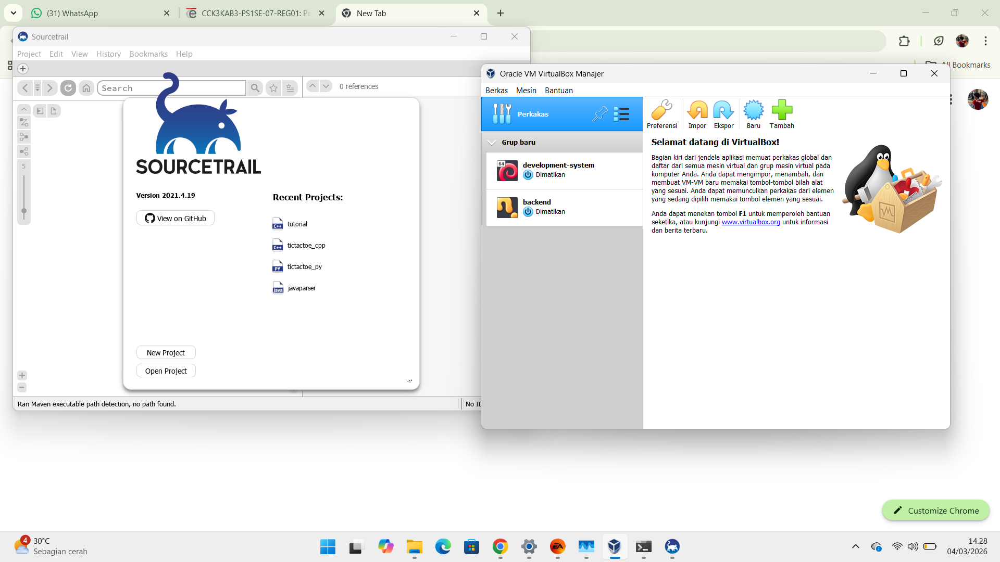

halo# <h1 align="center">Laporan Praktikum Modul 01   Running_Modul</h1>

GHAZA ZIDANE NURRAIHAN - 2311104038

## Dasar Teori

yaang dipelajari saat pertemuan adalah kita melakukan penginstalan dan menggunakan cara pemakaian virtualbox, sourcetrail,Xinu

## Guided

## Referensi

1. https://en.wikipedia.org/wiki/Data_structure (diakses blablabla)